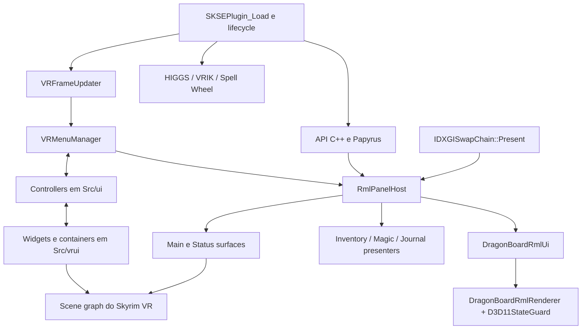
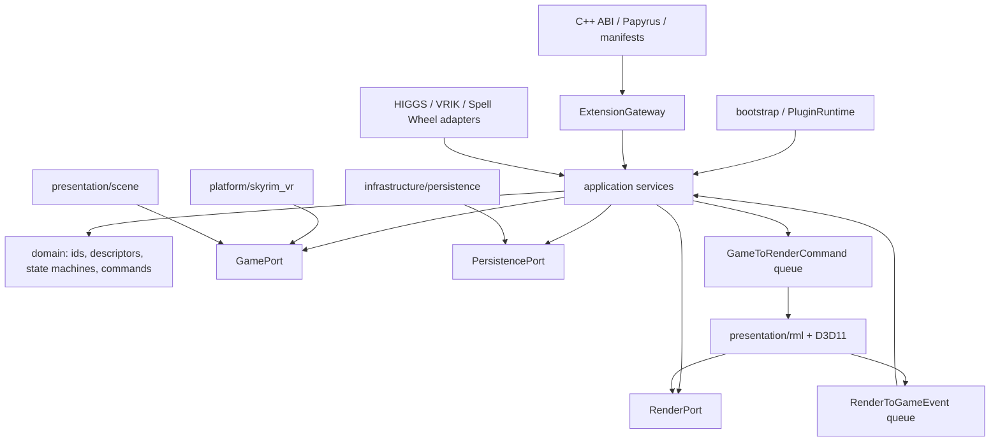

# DragonBoardVR — arquitetura atual e plano de evolução

## Objetivo

Este documento descreve a arquitetura atual do DragonBoardVR, identifica os limites que hoje dificultam evolução e propõe uma arquitetura-alvo incremental. Ele é prescritivo: deve orientar refactors, novas APIs e decisões de ownership sem alterar os contratos de experiência VR já estabelecidos.

Documentos relacionados:

- `PROJECT_OVERVIEW.md`: inventário funcional e mapa do projeto atual;
- `TODO.md`: prioridades, pendências e critérios de conclusão;
- `RMLUI_INTEGRATION.md`: contrato técnico atual dos painéis RmlUi.

Snapshot analisado: 2026-07-20, branch `codex/finger-touch-diagnostic`, HEAD `73a630d`, incluindo o working tree local. A arquitetura-alvo não implica que o comportamento local ainda não validado esteja aprovado para release.

## Princípios que não podem ser perdidos

1. DragonBoardVR continua sendo exclusivo para Skyrim VR.
2. Hand-following é vínculo à scene graph do player; não é equivalente a world pinning.
3. O preview 3D vivo deve permanecer no Item Editor RML.
4. Trigger esquerdo e direito preservam equip/desequip de suas respectivas mãos.
5. CommonLib e objetos do Skyrim pertencem à game thread.
6. RmlUi e o render D3D11 pertencem à thread de `Present`.
7. Cada superfície independente possui recursos gráficos e caminho de textura próprios.
8. Customização do usuário é dado durável e não pode ser apagada por update do mod.
9. Refactors devem ser pequenos, buildáveis e reversíveis.
10. Build ou preview não substituem implantação conferida e validação dentro do Skyrim VR.

## Não objetivos

- adicionar suporte SE/AE;
- substituir RmlUi por outro toolkit;
- converter o projeto em microservices, ECS ou framework genérico sem necessidade;
- reescrever tudo antes de estabilizar lifecycle, package e testes;
- remover o state guard D3D11 sem nova medição;
- trocar imediatamente todos os formatos persistidos;
- remover fallbacks ou integrações antigas sem evidência de uso;
- esconder APIs do Skyrim atrás de abstrações que não criem um limite testável real.

## Arquitetura atual

### Visão estrutural



O projeto é um modular monolith em transição. `Src/ui/*` contém controllers extraídos, mas `Src/vrui/*` ainda mantém o estado e os objetos principais. Os dois lados incluem um ao outro: a análise encontrou 92 includes de `ui` para `vrui` e 26 no sentido contrário. Essa relação bidirecional impede uma fronteira clara.

### Composition root e lifecycle

`Src/main.cpp` é a entrada do plugin. Ele inicializa logging/SKSE, registra Papyrus e instala o listener de mensagens. `PluginLifecycle.cpp` distribui trabalho entre `kPostPostLoad`, `kInputLoaded`, `kDataLoaded`, `kPreLoadGame`, `kPostLoadGame` e `kNewGame`.

Pontos positivos:

- `SKSEPlugin_Load` permanece pequeno;
- integrações opcionais são inicializadas em lifecycle compatível;
- input e warm-up são idempotentes;
- save transitions limpam registros Papyrus e estados transitórios.

Limite atual: o lifecycle chama diversos singletons diretamente. Não há um objeto raiz que possua e encerre os serviços em uma ordem explícita. Isso dificulta reset, testes e cleanup de workers/hooks/resources.

### VRMenuManager

`VRMenuManager` é fachada, store de estado e ponto de coordenação. Controllers externos acessam internals por 12 declarações `friend`. Ele possui session state, inputs, cooldowns, schedulers, refresh, panel registry, navigation e deferred tasks.

O padrão de extração atual reduziu o tamanho do `.cpp`, mas não reduziu ownership: os controllers continuam mutando o estado privado do manager. Isso transforma classes menores em extensões do mesmo objeto, em vez de módulos independentes.

### RmlPanelHost

`RmlPanelHost` concentra:

- hook/renderer/render targets;
- state machine da página ativa;
- input bridge e haptics;
- registro e eventos da API externa;
- Settings, Developer, Mods e Item Editor;
- captura/ações de Inventory, Magic e Journal;
- quest target/marker;
- superfícies Main/Status;
- keyboard input;
- performance metrics;
- filas game-to-render e render-to-game.

Sinais mensuráveis:

- 5.162 linhas no `.cpp` e 614 no header;
- 53 membros `std::atomic` no header;
- 57 usos de mutex/locks no `.cpp`;
- branches repetidos por `LocalPanelMode` na game thread e no `Present`.

O problema não é somente tamanho. O mesmo objeto possui recursos com thread affinity diferente e coordena features de produto sem uma única invariável central. Isso torna fácil abrir uma página em um lado e deixar preview/visibilidade em estado antigo no outro.

### DragonBoardRmlUi

`DragonBoardRmlUi` possui documents, DOM bindings, pointer/scroll/slider, virtual lists, markup e eventos de todos os painéis. São 3.200 linhas no `.cpp` e 653 no header.

Ele é corretamente restrito à thread de render, mas mistura runtime RmlUi genérico com comportamento de Inventory, Magic, Journal, Settings, Developer, Mods e Item Editor. Uma mudança de painel pode afetar captura de input ou lists de outro painel.

### Scene UI histórica

`VRUIWidget`, `VRUIPanel`, `VRUIButton`, containers, editor e layout formam a UI física. `VRUIButton.cpp` possui 1.928 linhas e combina visual, label, hover, input, grab, pin, wiggle, transform e persistência indireta.

Os containers de Inventory/Magic ainda exercem duas funções:

- ler/executar gameplay;
- construir widgets 3D ou snapshots para RmlUi.

Isso mantém a tela RML dependente do backend de apresentação antigo.

### Persistência

Settings, layout, actions e dev commands usam arquivos separados. O comportamento funciona, mas não há facade única, schema version global, write atômico comum ou ownership formal dos dados.

INI, JSON e defaults podem representar o mesmo conceito de transform. O código precisa conhecer precedência e migração em vários locais.

### API pública

A API chama diretamente o singleton `RmlPanelHost`. A v2 adicionou capabilities e state, mas continua sendo uma interface C++ virtual exposta entre DLLs. Surface methods foram reservados na vtable, porém não implementados.

Faltam recursos de primeira classe para os pilares públicos:

- widgets/surfaces externos;
- botões externos;
- actions tipadas;
- lifecycle/error detalhado;
- owner lifetime;
- data binding dinâmico;
- paridade Papyrus.

## Diagnóstico arquitetural

### Problemas de ownership

| Estado/recurso | Dono atual | Problema |
| --- | --- | --- |
| Sessão do Board | `VRMenuManager` + lifecycle/controllers | Múltiplos friends alteram o mesmo estado |
| Página RML ativa | `VRMenuManager` + `RmlPanelHost` + `DragonBoardRmlUi` | Três representações podem divergir |
| Preview de item | `VRUIItemEditPanel` + `RmlPanelHost` | Lifecycle implícito durante navegação |
| Surface | `RmlPanelHost::SurfaceState` | Scene node e recursos D3D coexistem no mesmo aggregate cross-thread |
| Input | `VRFrameUpdater`, manager, controllers e `RmlInputBridge` | Botões físicos e intenções sem modelo semântico único |
| Persistência | Settings, layout manager e managers específicos | Precedência/migração distribuídas |
| Consumer externo | API impl + host + callback raw | Lifetime não é representado por owner |

### Problemas de dependência

- `ui` depende de `vrui` e `vrui` depende de `ui`;
- código de domínio/action ainda chama `VRMenuManager` para efeitos laterais;
- features RML incluem detalhes de scene UI histórica;
- integrações opcionais chamam o manager diretamente;
- API pública conhece o host concreto;
- persistence é chamada por widgets e controllers, não por um serviço proprietário.

### Problemas de state machine

Estados são representados por combinações de booleans, atomics, active panel names e `LocalPanelMode`. Uma transição como Inventory -> Journal envolve:

1. documento RML;
2. painel físico usado pelo preview;
3. source container;
4. status surface;
5. input capture;
6. page navigation;
7. callbacks/haptics.

Não existe hoje uma única operação transacional que declare a saída do estado antigo e a entrada no novo.

### Problemas de thread model

Atomics evitam data races isoladas, mas não garantem consistência entre vários campos relacionados. Exemplo: mode, visible, active external handle, pending sync e preview podem ser observados em combinações intermediárias.

O objetivo não é remover synchronization; é transportar mensagens imutáveis e fazer cada state machine ser mutada por uma única thread.

## Arquitetura-alvo

### Estilo recomendado

Manter um modular monolith com composition root explícito e ports somente nas fronteiras reais: Skyrim/SKSE, RmlUi/D3D11, filesystem e integrações externas.



### Regra de dependência

1. `domain` não inclui CommonLib, SKSE, RmlUi, D3D11 ou Windows.
2. `application` depende de domain e interfaces de ports.
3. adapters dependem de application/ports; application não depende dos adapters.
4. RmlUi recebe snapshots e emite eventos sem ler objetos do Skyrim.
5. scene presentation recebe transforms/models e não decide regras de gameplay.
6. API pública chama `ExtensionGateway`, não `RmlPanelHost`.
7. integrações publicam comandos/eventos; não mutam UI internamente.
8. bootstrap é o único lugar que constrói e conecta implementações.

Essas regras devem ser aplicadas por includes e targets de teste, não apenas por convenção escrita.

## Ownership proposto

### PluginRuntime

Objeto raiz criado durante `SKSEPlugin_Load` e válido até o fim do processo. Possui:

- lifecycle state;
- `BoardSessionController`;
- registries públicos;
- adapters de Skyrim/render/persistência;
- integration manager;
- worker de I/O encerrável;
- filas cross-thread.

O singleton pode continuar existindo como acesso ao composition root, mas serviços internos devem ser membros com lifetime explícito, não singletons independentes.

### BoardSessionController

Único dono da sessão e navegação:

```text
Closed -> Opening -> Home
Home <-> Page(pageId)
Home/Page -> Closing -> Closed
```

`NavigateTo(pageId)` executa uma transição completa:

1. valida o destino;
2. envia `Exit` à página anterior;
3. encerra preview/input capture associados;
4. atualiza o estado de sessão uma vez;
5. apresenta o painel físico necessário;
6. envia `ShowPage` ao render;
7. atualiza surfaces/widgets visíveis;
8. publica evento de lifecycle.

Nenhuma página deve chamar `Close()` e depois abrir outra por conta própria.

### InputRouter

Converte eventos físicos em intenções semânticas:

```cpp
struct UiIntent {
    IntentType type;
    PhysicalHand physicalHand;
    InteractionRole role;
    PointerSample pointer;
};
```

`PhysicalHand` deve sempre acompanhar equip/click. `InteractionRole` indica menu hand, pointer hand ou offhand sem apagar a mão física. Laser, finger touch e futuras fontes produzem a mesma família de intents e disputam prioridade por uma regra explícita.

### PageRegistry

Possui `PageDescriptor`, owner, load state, callback e binding do documento. Pages internas e externas usam o mesmo registry; o conteúdo específico fica em providers.

State machine:

```text
Unregistered -> Queued -> Loading -> Ready -> Visible
                         -> Failed
Ready/Visible -> Hidden -> Destroying -> Unregistered
```

### SurfaceRegistry

Cada surface é representada por duas metades ligadas por `SurfaceId`:

- `GameSurfaceInstance`: anchor, scene node, transform, bounds, grab e visibilidade;
- `RenderSurfaceInstance`: Rml context, texture, RTV, SRV, renderer state e dirty scheduler.

A game thread nunca muta `RenderSurfaceInstance`; o `Present` nunca muta scene nodes. `SurfaceRegistry` coordena o lifecycle por mensagens e só anuncia `Ready` quando as duas metades confirmam criação.

### ButtonRegistry

`ButtonDescriptor` define id, owner, label/icon/model, container inicial e `ActionId`. O botão visual não possui uma lambda de negócio. Ele emite `InvokeAction(ActionId, hand)`.

Separar:

- definição distribuída pelo autor;
- override do usuário (transform, label visibility, favorite/default);
- instância runtime scene graph.

Assim, atualizar a definição não apaga a customização.

### ActionRegistry e ActionDispatcher

Actions internas e externas usam tipos explícitos:

- `OpenPage`;
- `ShowGameMenu`;
- `QuickSave`;
- `ConsoleCommand`;
- `CastForm`;
- `EquipForm`;
- callback externo versionado.

`ActionDispatcher` valida owner, contexto, mão, cooldown e confirmação antes de executar na game thread. Form references persistidos devem usar plugin/local id estável.

### PersistenceService

Facade única para settings, layout, buttons, surfaces e actions. Inicialmente ela continua lendo os formatos atuais por adapters, evitando uma migração big-bang.

Precedência recomendada:

```text
defaults do código
  < defaults distribuídos pelo mod/consumer
  < configuração persistida do usuário
  < draft da sessão atual
```

Transform runtime canônico:

- position;
- rotation sem round-trip Euler destrutivo (quaternion normalizado ou matriz 3x3);
- uniform scale;
- schema version.

A UI pode continuar exibindo Euler em graus. O loader migra Euler/matrix legados para a representação canônica. Writes devem ser atômicos, com backup e validação de valores finitos.

### RmlPageRuntime

Responsável somente por:

- iniciar RmlUi e carregar documents;
- aplicar `GameToRenderCommand`;
- processar pointer/scroll;
- renderizar a página ativa;
- emitir `RenderToGameEvent`;
- reportar load/render errors.

Comportamento específico é separado em `PageProvider`s:

- `InventoryPageProvider`;
- `MagicPageProvider`;
- `JournalPageProvider`;
- `SettingsPageProvider`;
- `DeveloperPageProvider`;
- `ModsPageProvider`;
- `ItemEditPageProvider`.

Provider na game thread captura snapshot e executa intents. Adapter de view na render thread sabe apenas aplicar snapshot ao DOM. Não criar uma classe por função: extrair somente onde há ownership, invariável ou teste independente.

### GameSnapshotService

Leituras de player/inventory/magic/quest/stats produzem DTOs imutáveis. Nenhum DTO contém ponteiro CommonLib. Snapshot tem revision/signature para render-on-dirty e pode ser descartado se uma versão mais nova já estiver na fila.

## Modelo de comunicação entre threads

### Input callback

- captura valores físicos mínimos;
- publica `InputSnapshot` ou `UiIntent`;
- não abre painel, equipa item ou toca DOM diretamente.

### Game thread

- única dona de session/page/surface lifecycle lógico;
- lê Skyrim e produz snapshots;
- executa actions e callbacks externos;
- altera scene graph;
- solicita persistência.

### Present thread

- única dona de RmlUi e recursos D3D11 do mod;
- aplica comandos imutáveis;
- produz eventos imutáveis;
- não chama CommonLib/gameplay.

### I/O worker

- recebe cópias serializáveis;
- possui stop token e `join` no shutdown;
- escreve temp + flush + replace;
- nunca usa references a serviços destruíveis.

### Tipos de mensagem

Usar `std::variant` ou structs tagged, não dezenas de atomics relacionadas:

```text
GameToRenderCommand:
  LoadPage | UnloadPage | ShowPage | HidePage
  ApplySnapshot | ApplyDomBatch
  CreateRenderSurface | DestroyRenderSurface
  SetSurfaceVisibility | SetPointer

RenderToGameEvent:
  PageReady | PageFailed | ElementEvent
  CloseRequested | ActionRequested
  SurfaceRenderReady | SurfaceRenderFailed
  HapticRequested | RenderMetrics
```

Atomics continuam apropriadas para counters ou último pointer sample independente. Uma transição multi-campo deve ser uma mensagem ou state object versionado.

## API pública futura

### Compatibilidade

Manter `RequestPluginAPI()` e `RequestPluginAPI2()` como adapters durante a migração. Para a próxima geração, preferir uma ABI C com function table versionada e `structSize`, evitando expor vtables C++ entre DLLs.

Exemplo conceitual:

```cpp
struct DragonBoardInterfaceV3 {
    std::uint32_t structSize;
    std::uint32_t version;
    std::uint64_t capabilities;
    PageHandle (*registerPage)(OwnerToken, const PageDescriptor*);
    SurfaceHandle (*createSurface)(OwnerToken, const SurfaceDescriptor*);
    ButtonHandle (*registerButton)(OwnerToken, const ButtonDescriptor*);
    ActionHandle (*registerAction)(OwnerToken, const ActionDescriptor*);
};
```

Descriptors devem ser copiados no registro. Handles devem conter geração ou ser validados contra stale reuse. Todo recurso pertence a `OwnerToken`; cleanup do owner invalida callbacks e remove seus resources em ordem segura.

### Manifest declarativo

Mods sem C++ podem fornecer manifest versionado com pages, widgets, buttons e action bindings. Papyrus usa a mesma `ExtensionGateway`; não deve existir um segundo sistema de registry.

### Capabilities

Capability só é anunciada quando:

- implementação está ligada ao registry real;
- lifecycle de criação/destruição está testado;
- erro é observável;
- sample consumer funciona;
- compatibilidade foi exercitada.

## Estrutura de diretórios desejada

Estrutura conceitual, a ser alcançada gradualmente:

```text
Src/
  bootstrap/                 composition root e lifecycle SKSE
  domain/                    ids, descriptors, transforms, state machines
  application/               session, navigation, registries, actions
  ports/                     GamePort, RenderPort, PersistencePort
  platform/skyrim_vr/        CommonLib, input, haptics, game actions
  presentation/scene/        panels, buttons, previews, pins, anchors
  presentation/rml/          page runtime, surfaces, DOM view adapters
  infrastructure/persistence/
  api/                       ABI C++, Papyrus e manifest gateway
  integrations/              adapters HIGGS, VRIK e Spell Wheel
  diagnostics/
```

Não mover arquivos apenas para satisfazer a árvore. Primeiro criar o limite e testes; mover quando os includes apontarem em uma única direção.

## Mapeamento de extração

| Atual | Destino gradual |
| --- | --- |
| `VRMenuManager` session/lifecycle | `BoardSessionController` |
| `VRMenuManager` input fields | `InputRouter` + `InputState` |
| `VRMenuManager` panel registry/navigation | `PageRegistry` + `NavigationService` |
| `RmlPanelHost` external panels | `PageRegistry` + `ExtensionGateway` |
| `RmlPanelHost` render resources | `RmlRenderDevice` / `RmlPageRuntime` |
| `RmlPanelHost` surfaces | `SurfaceRegistry` e duas instâncias por thread |
| `RmlPanelHost` Inventory/Magic/Journal | feature providers + snapshot services |
| `DragonBoardRmlUi` bindings específicos | view adapters por page |
| `VRUIButton` action lambdas | `ButtonRegistry` + `ActionDispatcher` |
| `VRUIButton` grab/pin/label | behaviors componíveis da apresentação scene |
| `VRUISettings` monolítico | settings sections + `PersistenceService` |
| Containers como backend RML | repositories/snapshot providers independentes da UI 3D |

## Estratégia incremental de migração

### Fase 0 — baseline protegida

Relacionada a P0-01 até P0-05.

- preservar working tree;
- package manifest e versões coerentes;
- matriz mínima in-game;
- testes atuais executáveis.

Gate: nenhum refactor estrutural antes de uma baseline recuperável.

### Fase 1 — composition root e contratos puros

- introduzir `PluginRuntime` sem remover singletons;
- criar ids, descriptors, transforms e events puros;
- adicionar testes para state machines e queues;
- adapters antigos delegam ao runtime.

Gate: build e comportamento idênticos; nenhuma mudança visual.

### Fase 2 — sessão e navegação transacionais

- criar `BoardSessionController`;
- centralizar open/close/navigate;
- adaptar `VRMenuManager` como façade;
- corrigir Inventory/Magic -> Journal/Settings por essa seam.

Gate: matriz de transição com um click, preview e surfaces coerentes.

### Fase 3 — input semântico

- introduzir `UiIntent` com mão física;
- adaptar laser primeiro;
- integrar finger touch somente depois com a mesma interface;
- remover leitura direta de campos de botão pelos features.

Gate: ativação e equip testados nas duas mãos.

### Fase 4 — facade de persistência

- encapsular formatos atuais;
- adicionar schema, validação, atomic write e backup;
- separar definition do autor e override do usuário;
- manter loaders legados.

Gate: round trip e migração testados; restart preserva transforms.

### Fase 5 — separar RML por thread e feature

- criar filas tipadas;
- mover lifecycle lógico para game thread;
- extrair `RmlPageRuntime` e view adapters;
- extrair snapshots/actions de Inventory, Magic e Journal;
- manter `RmlPanelHost` como façade temporária.

Gate: nenhuma chamada Skyrim no render; métricas não regridem.

### Fase 6 — registries e API v3

- PageRegistry/ExtensionGateway como fonte única;
- adapters v1/v2/Papyrus;
- lifecycle/errors/owner token;
- SDK e consumers de teste.

Gate: consumer antigo e novo passam contra a DLL nova.

### Fase 7 — surfaces, widgets e buttons públicos

- implementar SurfaceRegistry;
- migrar Status como primeiro consumer interno;
- habilitar capabilities de surfaces;
- implementar ButtonRegistry/ActionRegistry;
- adicionar manifest declarativo.

Gate: dois widgets externos simultâneos, botão externo e persistência após restart.

### Fase 8 — retirar pontes legadas

- remover fallbacks somente após telemetria/teste;
- eliminar includes bidirecionais `ui`/`vrui`;
- reduzir friends e singletons;
- arquivar código morto e atualizar docs.

Gate: package/release completo e matriz in-game integral.

## Estratégia de testes

### Testes puros

- state machines de plugin, Board, page e surface;
- input intent/hand mapping;
- action validation;
- layout migration e transform round trip;
- registries, owner cleanup e stale handles;
- snapshot filtering/selection;
- queue ordering e coalescing.

### Testes de adapter

- load de todos os RML/RCSS;
- D3D11 renderer no preview;
- package manifest;
- Papyrus compile;
- API sample consumer;
- fake GamePort para Inventory/Magic/Journal.

### Testes in-game

- lifecycle SKSE e save transitions;
- scene anchors/hand-following;
- equip por mão;
- preview/pins;
- surface texture isolation;
- integrações opcionais;
- restart e deployed hashes.

Arquitetura é considerada melhor somente quando reduz o custo de comprovar comportamento, não quando apenas aumenta o número de classes.

## Observabilidade

Cada transição deve logar uma linha estruturada com:

- subsystem;
- resource id/owner;
- estado anterior e novo;
- thread/domain;
- result/error code;
- revision do snapshot quando aplicável.

Exemplo:

```text
[page] id=DragonBoardVR.Inventory from=Ready to=Visible reason=Navigate revision=42
```

Performance logs permanecem amostrados. Não registrar pointer/mouse move em `info` por frame.

## Riscos e mitigação

| Risco | Mitigação |
| --- | --- |
| Regressão visual durante extração | Não alterar RML/RCSS no mesmo commit estrutural |
| Perda de transforms | Loader legado, backup e golden files |
| Latência por filas | Coalescer pointer/snapshots, medir p95/p99 |
| API quebrar mods externos | Adapters v1/v2 e compatibility tests |
| Textura cruzada entre surfaces | Resource/NIF/diffuse exclusivos por surface |
| State guard removido cedo | Manter até profiling novo e teste de contaminação |
| Overengineering | Extrair somente ownership/invariável testável |
| Refactor sem prova runtime | Gates de deploy/hash/restart por fase |
| Trabalho local perdido | Snapshot e commits por feature antes de mover arquivos |

## Decisões recomendadas para ADRs

Criar registros curtos em `docs/adr/` quando a implementação começar:

1. DragonBoardVR permanece VR-only.
2. Modular monolith com ports nas fronteiras runtime.
3. Game thread possui lifecycle lógico; Present possui RmlUi/D3D11.
4. Comunicação cross-thread por mensagens imutáveis.
5. API futura por function table versionada, mantendo adapters v1/v2.
6. Definition do autor separada de override do usuário.
7. Surface possui metades game/render e asset path exclusivo.
8. Persistência versionada com writes atômicos e loaders legados.

ADR registra contexto, decisão, alternativas e consequências. Não deve virar diário de implementação.

## Critério de sucesso da evolução

A migração estará cumprindo o objetivo quando:

- uma transição de página tiver um único dono e uma única state machine;
- nenhuma classe cross-thread possuir simultaneamente objetos Skyrim e objetos RmlUi mutáveis;
- features consumirem snapshots e actions, não containers de UI antigos;
- pages, surfaces, buttons e actions internos/externos usarem os mesmos registries;
- a API informar lifecycle e erros sem depender do log;
- customizações sobreviverem a updates e migrações;
- novos painéis/widgets puderem ser adicionados sem editar monólitos centrais;
- cada fase puder ser validada offline e dentro do Skyrim VR;
- o package for reproduzível a partir de checkout limpo.
